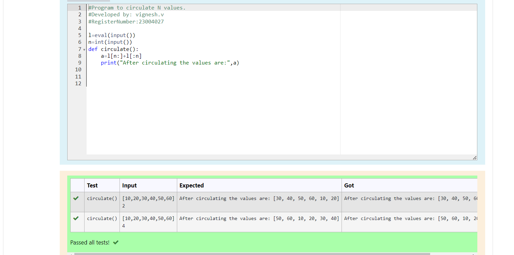

# Circulate-the-values-of-N-variables
## Aim:
To write a python program to circulate the n variables using function concept
## Equipment’s required:
PC
Anaconda - Python 3.7
## Algorithm: 
### Step 1:
Get the two values from the user 
### Step 2: 
Assign the values of second variable to a temporay variable
### Step 3: 
Assign the values of first variable to the second variable
### Step 4:
Assign the values in temporary variable to the first variable
### Step 5: 
print both the values it would be interchanged
### Step 6: 
End the program
## Program:
```python
#Program to circulate N values.
#Developed by: vignesh.v
#RegisterNumber:23004027

l=eval(input())
n=int(input())
def circulate():
    a=l[n:]+l[:n]
    print("After circulating the values are:",a)
```

## Output:


## Result:
The circulate a values of N variable is successfully executed